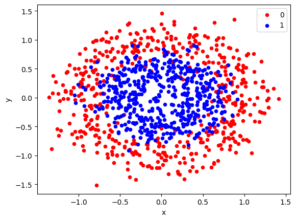
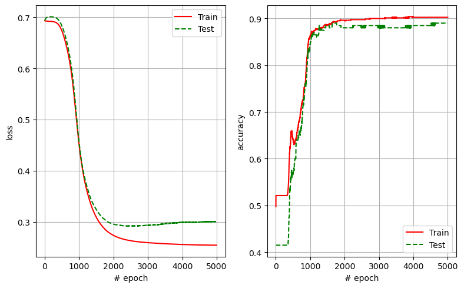
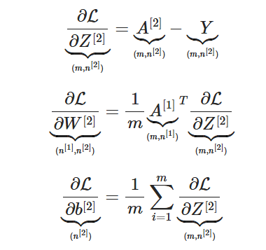
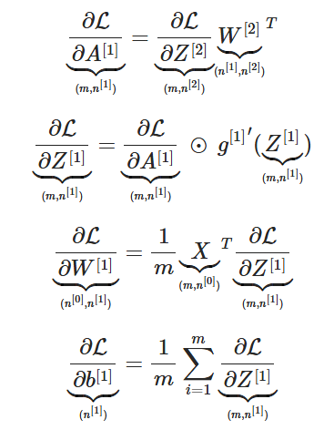
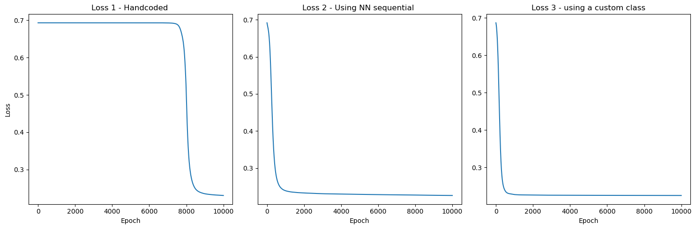
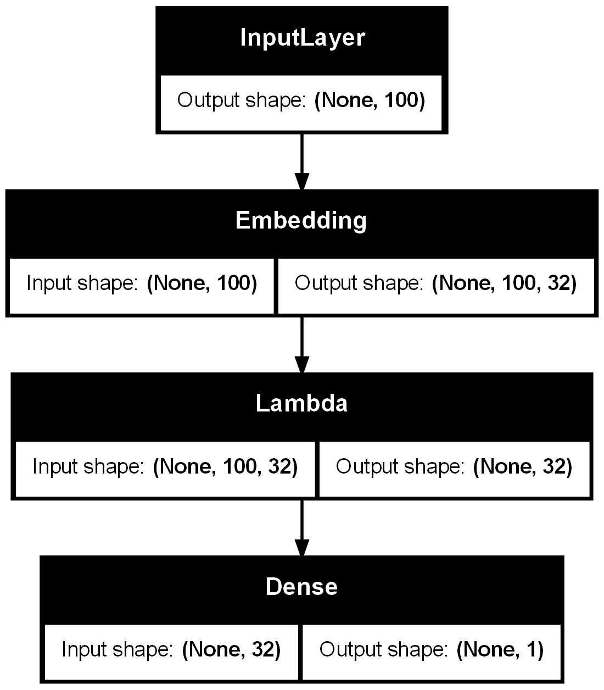
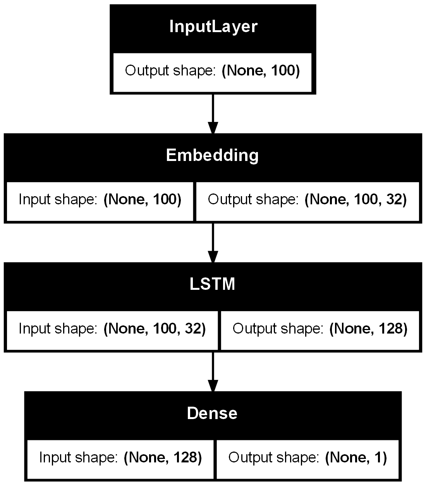

# Deep Learning Projects

This repository contains various deep learning projects implemented in Jupyter notebooks, accompanied by relevant visualizations. For each project some selected plots are shown.

---

## Projects

1. **[Project 1: MLP for Classification](1 - MLP for classification.ipynb)**
   - **Description**: A hand-coded Multi-Layer Perceptron (MLP) for basic classification with one hidden layer.
  
- **Plots**:
  - **Input Data**:  
      

  - **Training Metrics**:  
      

  - **Backward Propagation Equations**:  
   

  
  

2. **[Project 2: MLP using Pytroch ](project2.ipynb)**
   - Description: For the same use case (classfication) we use Pytorch, with 3 different implementations : by hand, through the nn.sequential class, and creating a custom class. We make use of "autograd" available in pytorch to perform BP automatically 
   - Plots:  
     

3. **[Project 3: RNN for movie rating prediction ]()**
   - Description:  
   We preprocess movie reviews from IMDB database, and aim to predict the rating 'good' or 'bad'.  
   We first use a simple fully connected approach, and we average the embeddings :  
   review_one_hot_encoded (review_len*dim_dictionnary) --EMBEDDING MATRIX (dim_dictionnary x embedding_dim) --> embedings .  
   Then embeddings (review_len*embedding_dim) --AVERAGE--> avg_embedding(embedding_dim) -- FC + activation --> rating (0 or 1)  
     
  Doing so, we train the EMBEDDING MATRIX. Which grasps the "proximity", in terms of meaning, of words for instance.
  Then we replace the averaging of the embeddings by a LSTM many-to-one : we gain 1 pt of accuracy compared to the fully connected approach.
  
   - Plots:
   

  
  

3. **[Project 3: RNN for movie rating prediction ]()**
   - Description:  
   We preprocess movie reviews from IMDB database, and aim to predict the rating 'good' or 'bad'.  
   We first use a simple fully connected approach, and we average the embeddings :  
   review_one_hot_encoded (review_len*dim_dictionnary) --EMBEDDING MATRIX (dim_dictionnary x embedding_dim) --> embedings .  
   Then embeddings (review_len*embedding_dim) --AVERAGE--> avg_embedding(embedding_dim) -- FC + activation --> rating (0 or 1)  
     
  Doing so, we train the EMBEDDING MATRIX. Which grasps the "proximity", in terms of meaning, of words for instance.
  Then we replace the averaging of the embeddings by a LSTM many-to-one : we gain 1 pt of accuracy compared to the fully connected approach.
  
   - Plots of the architecture used :
   

  
  

     