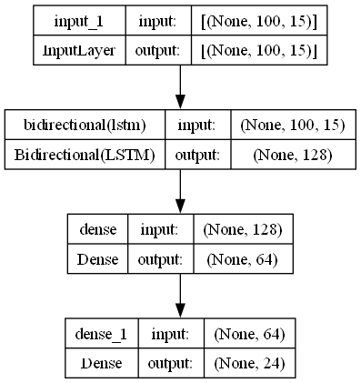
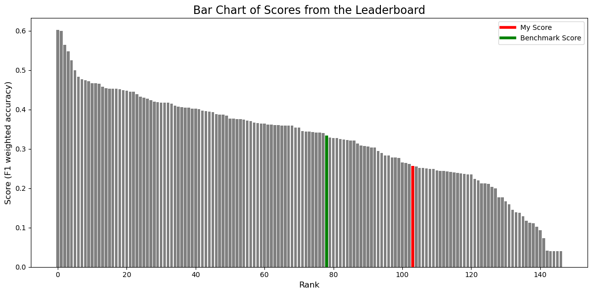

# Stock Classification from Tick-by-Tick Data

## Overview
This project aims to predict which stock is being traded by using inforation from  100-event sequences of tick-by-tick order-book data.   
This challenge is from "High frequency market data: could you guess the stock? by CFM"
 

<link> https://challengedata.ens.fr/participants/challenges/146/

## Dataset
- **Rows:** ~24 million (504 days × 24 stocks × 20 observations/day × 100 events/observation).
- **Features:**
  - `venue`, `action`, `price`, `bid`, `ask`, `bid_size`, `ask_size`, etc. 

Here is a description of each column in the dataset.  

| Column | Description |
| ------ | ------------ |
| **Obs_id** | which observation are we taking into account  -> for that observation we will keep track of the next 100 operations in the book orders |
| **Venue_id** | for a given stock, exchanges can happen across many venues :  this id tracks which venue we consider   ==> it could be of importance (some stocks are typically traded across many venues ?) |
| **order_id** | for a given observation sequence, each operation is related to an order. An order can be added, updated, deleted.  The order_id allows to track the lifecycle of individual orders within a sequence.   |
| **action** |  A (adding an order to the book) , D (Deleting an order from the book), U = updating an action from the book |
| **side** | B (bids, values to buy the action) , A (Ask, values to sell the action) 
| **Price** | - price : price of the order that was affected. *This best_bid_price , at the time of the first event, is substracted from all price reated columns (price, bid, ask  ) |
| **bid , ask** |- bid , ask == best bid (highest bid) /best ask (lowest ask)   |
| **bid_size, ask_size** |  volume of orders at the best bid, respectively ask, price  , on the *aggregated book*   => this too could be a valuable information, perhaps some stocks are encoutering more volume than others.  |
|**flux** | the change in volume at a specific price level in the order book due to a particular event |
|**Trade**|A boolean true or false to indicate whether a deletion or update event was due to a trade or due to a cancellation.   Most Deletions and updates actually dont occur from Trades

- **Target:** Stock label (24 classes).

## Approach
After some exploration and due to computing constraints, I limited my approach to reproducing the benchmark. 

I slightly changed the feature preproessing.

## Summary 
#### Design
I designed my (very simple) model.    

 

#### Preprocessing 
I did the preprocessing : which meant processing features and also transforming the row-by-row data into sequence by sequence data, that could be fed to the LSTM.   

original shape : rows(16M) x n_features(12) 
 
New shape : N_observations(1.6M) x observation_lenght (100) x Nfeatures_processed (15)

#### Training 
I then trained my model on my CPU for a total of 10e3 epochs, processing each epoch through batches of 10e3 sequences (which made 13 batches per epoch) 
 
In order to fit the training data in memory, I had to design a clever DataLoader class that deleted and cleaned memory on the go.
  
#### Results 
F1 Score of 0.256 (benchmark was 0.33)
 

#### Comments
The model is very simple, hence it doesent capture the full complexity of the Data and does not allow for great results.
 
Due to limited computational ressources, I cannot train more complex models: adding a LSTM layer (with return sequences = True) to improve the LSTM embedding of the sequence resulted in oom error.

Improvements to be made :
- impro

## Usage
conda env create -f spec-file.yml

